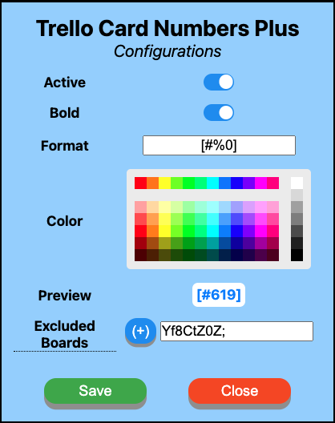

  

# Trello Card Numbers Plus

A fully customizable Chrome extension show card ID and counting cards in each list.

With card IDs it's much easier to refer to a specific card with your team and in commit messages.

This extension provides full customization of the card numbers, have a look!

  

## Features

- Show card ID
- Customize card ID format
- Toggle card ID display
- Count cards for each list
- Configs live reload

### Planned features

- Toggle cards count display
- _...you can suggest a new feature!_

## Install from Chrome Web Store

You can install the Chrome extension with a click from the [Chrome Web Store](https://chrome.google.com/webstore/detail/trello-card-numbers-plus/ncibjlmfhjcjnphnpphgphbflpdpliei).

## Contributing

If you have suggestions you can open an issue, or even create a pull request! It will be reviewd as soon as possible. Thank you!

  

